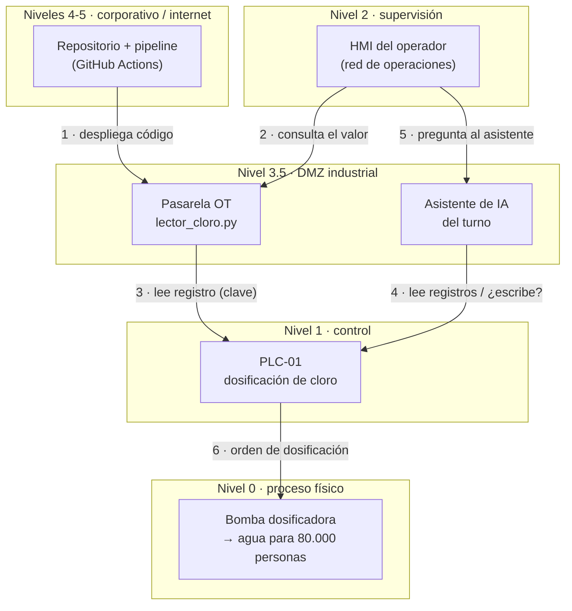

# Fase A · Modelo de amenazas · Equipo 1 · Agua potable

Las cuatro preguntas del Threat Modeling Manifesto, respondidas para la planta Maipo Sur (ficticia).

## 1 · ¿Qué estamos haciendo?

Versión digital del dibujo en papel (las cajas y las flechas). Leído de arriba hacia abajo según el modelo Purdue.

## 2 · ¿Qué puede salir mal? (al menos una idea por flecha, con STRIDE)

| Flecha | Categoría | Qué puede salir mal |
|---|---|---|
| 1 · repo → pasarela | Manipulación | Una dependencia sin versión fija o un parche de IA no revisado llega a la planta sin que nadie lo apruebe. |
| 1 · repo → pasarela | Filtración | La clave del PLC queda escrita en un repositorio público (y en su historial). |
| 2 · HMI → lector | Manipulación | El operador ve «NORMAL» porque alguien alteró la lectura en el camino. |
| 3 · lector → PLC | Suplantación | Alguien entra al PLC con la credencial de fábrica `1111`, publicada en el manual. |
| 3 · lector → PLC | Denegación | El atacante cambia la clave y la IP del PLC y deja fuera a los propios operadores (boletín de las 02:15). |
| 4 · IA → PLC | Elevación de privilegios | Un texto inyectado convierte al asistente en un canal de órdenes al PLC (puede escribir registros sin confirmación). |
| 5 · operador → IA | Filtración | El asistente tiene la clave en su contexto y la revela si se lo piden con ingenio (Gandalf). |
| 6 · PLC → bomba | Repudio | Cambia el setpoint y nadie puede demostrar quién dio la orden. |

## 3 · ¿Qué vamos a hacer al respecto? · Las tres amenazas elegidas

Criterio: **impacto en el proceso físico**, no dificultad técnica.

| # | Amenaza | Categoría | Impacto en el agua | Control que la detecta |
|---|---|---|---|---|
| A1 | Acceso al PLC con la **credencial de fábrica** y acceso remoto abierto | Suplantación + Denegación | El atacante cambia la dosis de cloro y bloquea a los operadores: sobredosificación (agua tóxica) o falta de cloro (agua sin desinfectar) para 80.000 personas, sin que el turno pueda corregirlo. | Control 1: regla `credencial-de-fabrica` (semgrep) + Control 3: salida de la pasarela solo hacia la red OT |
| A2 | **Clave del PLC escrita en el repositorio** público | Filtración → Manipulación | Cualquiera que lea el repo puede entrar a la pasarela y falsear la lectura: el operador ve «NORMAL» mientras el agua sale sin cloro suficiente. | Control 1: gitleaks sobre **todo el historial** + reglas en español |
| A3 | **Asistente de IA con permiso de escritura** en el PLC y sin confirmación humana | Elevación de privilegios | Una inyección de instrucciones termina en una orden real: «sube el setpoint de cloro al máximo». Riesgo directo para la salud de la población. | Control 1: regla `asistente-ia-con-escritura-en-plc` (semgrep) |

## 4 · ¿Lo hicimos bien?

Sí: cada amenaza elegida tiene un control automático que la detecta y que **se probó fallando** (commit `dce0320`, pipeline en rojo) antes de pasar a verde con la corrección (commit `aa5b9d0`). Ver `ENTREGABLE.md`, secciones 4 y 5.

Mapeo opcional a MITRE ATT&CK for ICS: A1 → T0812 *Default Credentials*; A2 → T0859 *Valid Accounts*; A3 → T0855 *Unauthorized Command Message*.
